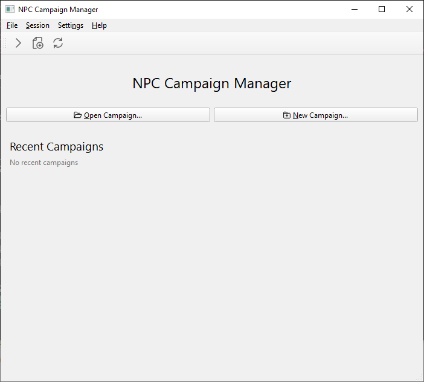
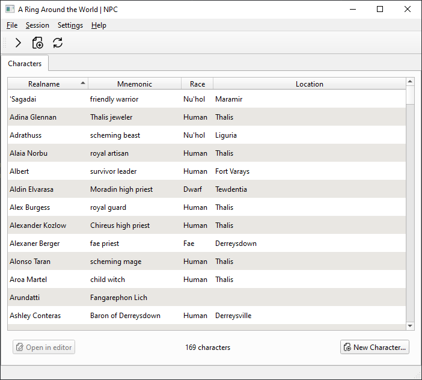
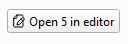

.. _guide_gui_quickstart:

GUI Quickstart
==============

Since it's a graphical app, the NPC GUI is relatively intuitive to use, especially once you're familiar with the way NPC handles :ref:`basics`. While using it, you can hover your mouse over nearly any element to see a tooltip about what it does.

Welcome Screen
----------------

When you open the NPC app, you'll see the welcome screen.

This screen has shortcuts to open your most recent campaigns, as well as to open or create a new one.

Campaign View
-------------

Once a campaign is open, you'll see a screen that shows the characters for that campaign, and various campaign-related actions will be enabled.

Opening Files
-------------

To open one or more character files, select them in the list then click :guilabel:`Open in editor` on the bottom left.

This will open the selected character files in your editor of choice. See :ref:`setting_editor` for how to configure this if the default doesn't work.
